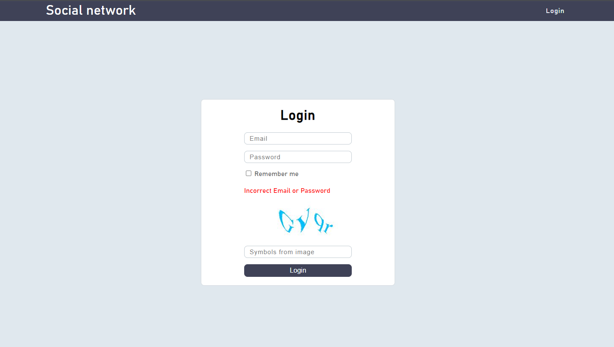
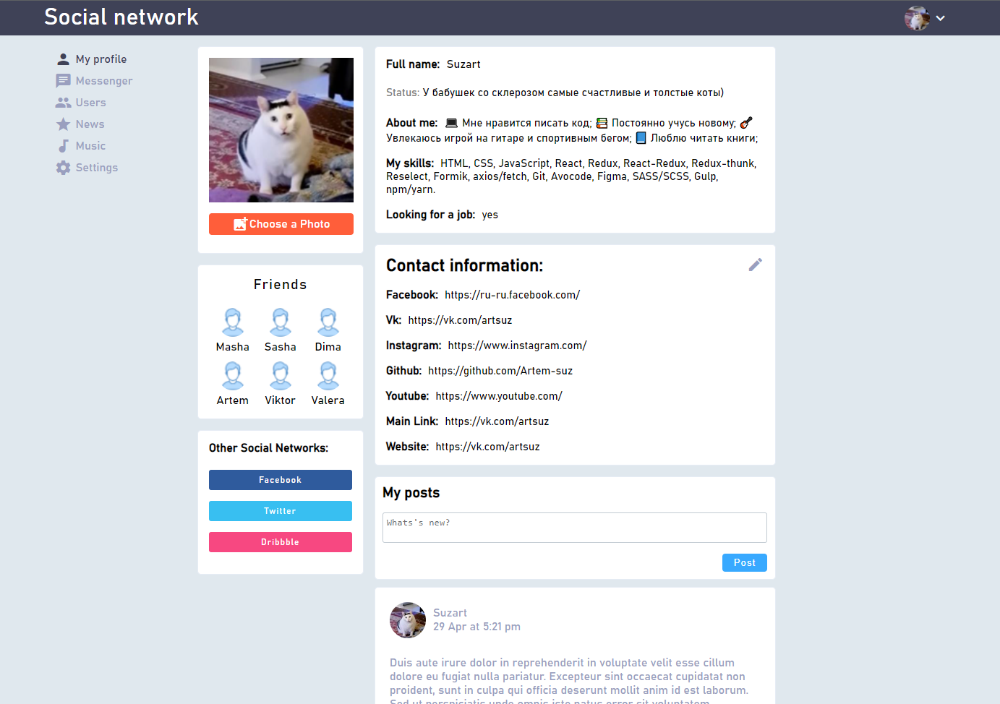
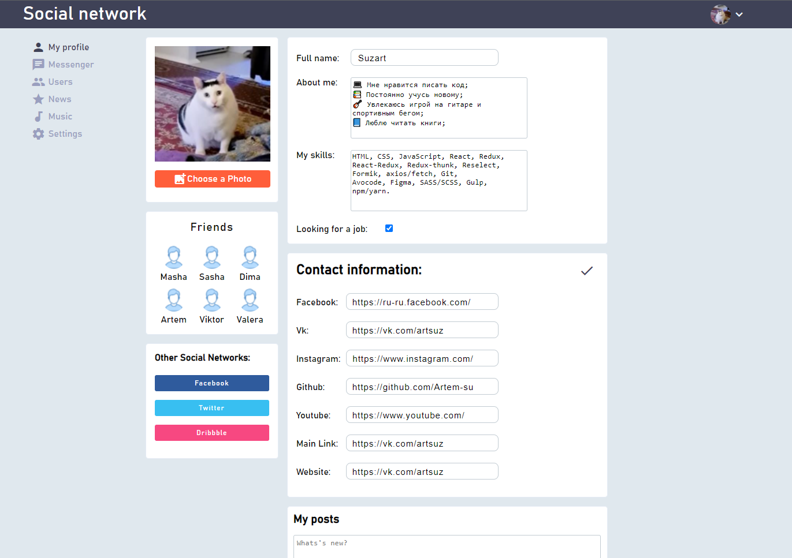
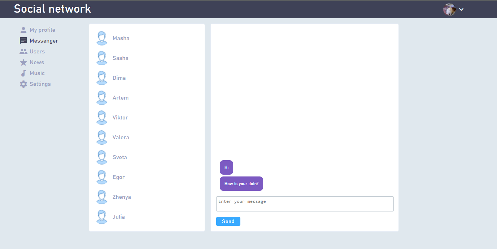
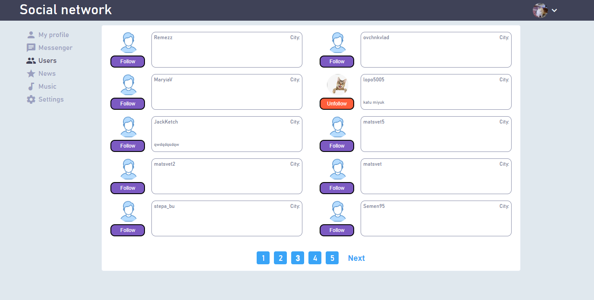
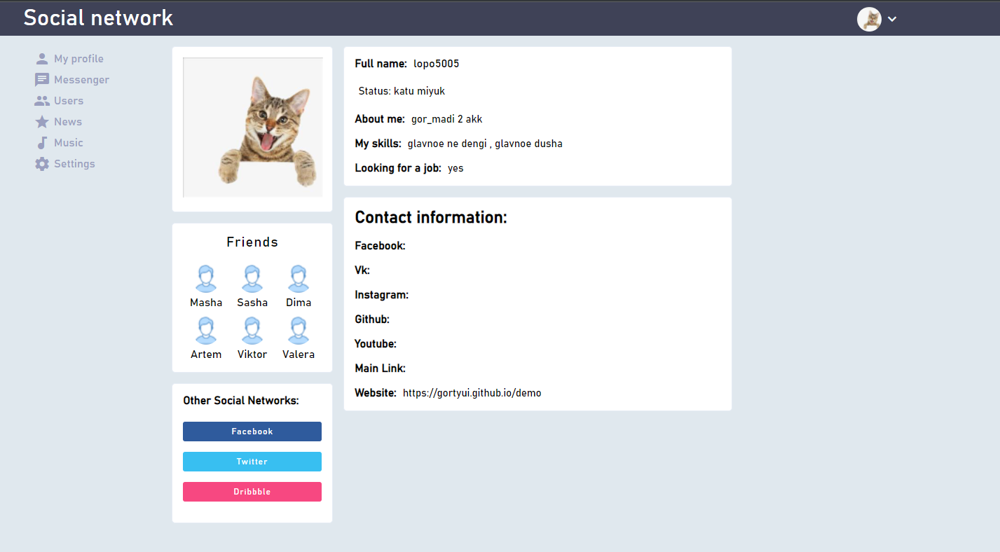

# Социальная сеть

В данном проекте представлена верстка и реализация части функционала социальной сети.

## Цель проекта

1. Получение опыта работы с библиотекой React.
2. Получение опыта работы с Redux, Redux-thunk.
3. Получение опыта работы с библиотекой Formik.
4. Получение опыта работы с библиотекой Reselect.
5. Получение опыта работы с библиотекой axios.
6. Обучение реализации логинизации пользователя.
7. Обучение по настройке роутов.

## Запуск проекта

### https://artem-suz.github.io/React-Social-network/

#### Логин: kudireva@mail.ru

#### Пароль: A1qaz2wsx

## Функционал

- Страница **Login**:

  - Ошибочный ввод логина или пароля провоцирует валидацию формы.
  - Серия ошибочных вводов пароля или логина генерирует **каптчу**.

- Страница **My profile**:

  - В шапке сайта, в правом углу, реализован **Logout**.
  - Реализован функционал по обновлению **аватара** пользователя.
  - Смена **статуса** профиля пользователя осуществляется по клику на него.
  - **Редактирование** остальной информации пользователя осуществляется по кнопке "карандаш".
    - Форма Contact information имеет валидацию по формату ссылок и кол-ву символов.
    - При активном чекбоксе 'Looking for a job' - результат формы 'My skills' станет виден в профиле пользователя, а 'Looking for a job' примет значение 'yes' (в противном случае 'no').
  - Форма **My posts** отправляет полученные данные только в BLL, т.к сервер не поддерживает эту функцию. Реализована валидация по кол-ву символов.
  - Блок **Other Social Networks** отображает ссылки на другие соц.сети.
  - Блок **Friends** - только верстка.

- Страница **Messenger**:
  - Из-за ограниченого функционала учебного сервера - реализована верстка и **форма по отправке сообщений пользователям**.
- Страница **Users**:
  - Реализована подгрузка зарегистрированных пользователей с сервера. Наполнение отрисованных карточек зависит от заполненных пользователями данных.
  - Реализован функционал **подписки** на пользователей.
  - Кликнув по аватару пользователя - осуществится подгрузка профиля.
  - Реализована **пагинация** по 10 пользователей.
- Страница **News**:
  - На данный момент сервер не распологает данным функционалом.
- Страница **Music**:
  - На данный момент сервер не распологает данным функционалом.
- Страница **Settings**:
  - На данный момент сервер не распологает данным функционалом.

## Используемые технологии

- [HTML](https://developer.mozilla.org/ru/docs/Learn/Getting_started_with_the_web/HTML_basics) - язык разметки веб-страницы.
- [JS](https://developer.mozilla.org/ru/docs/Learn/JavaScript/First_steps/What_is_JavaScript) - язык программирования позволяющий создать динамичные веб-приложения.
- [React](https://ru.reactjs.org/docs/getting-started.html) - это JavaScript-библиотека для создания пользовательских интерфейсов.
- [React Router](https://v5.reactrouter.com/web/guides/quick-start) - это библиотека маршрутизации (routing) в React.
- [Redux](https://redux.js.org/) - это библиотека управления состоянием для приложений, написанных на JavaScript.
- [Redux Thunk](https://github.com/reduxjs/redux-thunk) - это middleware библиотека, которая позволяет вызвать action creator, возвращая при этом функцию вместо объекта.
- [Reselect](https://github.com/reduxjs/reselect) - это библиотека для создания мемоизированных, пригодных для компоновки селекторных функций.
- [Formik](https://formik.org/docs/overview) - это библиотека, помогающая работать с формами.
- [axios](https://github.com/axios/axios) - это библиотека, позволяющая делать HTTP-запросы.

## Вид интерфейса

